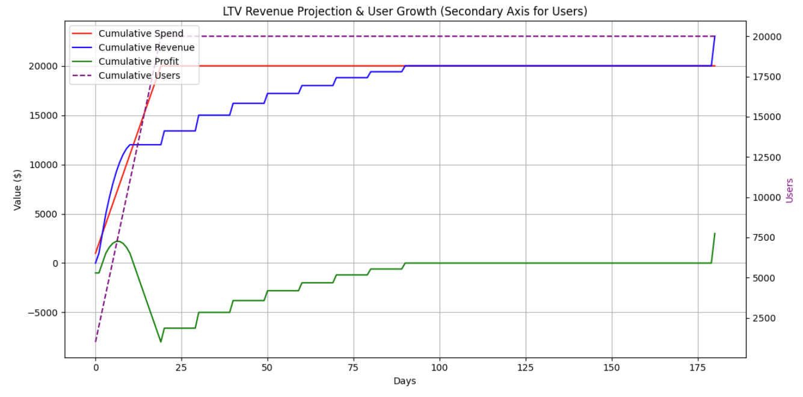

# LTV Revenue Projection Model 

This Python code implements an Expected Lifetime Value (LTV) revenue projection model, as described in Eric Benjamin Seufert's article "Building a marketing P&L using LTV and ROAS". It utilizes the Pandas library for data manipulation and Matplotlib for generating visualizations of the projected revenue, spend, profit, and user growth over time.



## Overview

The script calculates and projects revenue based on a provided cumulative revenue curve, acquisition parameters (number of acquisition days, users acquired per day, and cost per install - CPI). It simulates the revenue generation of cohorts acquired over a period and tracks daily and cumulative metrics like revenue, cost, profit/loss, and user count.

The model helps to:

- **Project future revenue:** Estimate the revenue expected from acquired user cohorts based on an LTV curve.
- **Analyze profitability:** Understand the daily and cumulative profit/loss over time.
- **Visualize performance:** Plot revenue, spend, profit, and user growth to gain insights into campaign performance and break-even points.
- **Assess cash flow:** Determine the maximum cash at risk and the time to recoup marketing spend.

## How to Use

### Prerequisites

Make sure you have Python installed along with the following libraries:

- **Pandas:** For data manipulation and analysis.
- **NumPy:** For numerical operations (implicitly used by Pandas).
- **Matplotlib:** For plotting graphs.

You can install these libraries using pip:

```bash
pip install pandas numpy matplotlib
```

### Input Parameters

The calculate_ltv_revenue_projection function takes the following inputs:

- **cumulative_revenue_curve (dict):** A dictionary defining the cumulative revenue per user over time (days). Keys are days (integers), and values are the cumulative revenue per
user (floats).
    - Example: {1: 0.05, 20: 0.67, 90: 1.00, 180: 1.15}
- **acquisition_days (int):** The number of days for which user acquisition campaigns are run.
- **users_per_day (int):** The number of users acquired each day during the acquisition period.
- **cpi (float):** Cost Per Install (or Cost Per Acquisition) for each user.

### Running the Code

1. **Save the Python script:** Save the provided Python code to a file, for example, ltv_projection.py.
2. **Run the script:** Execute the script from your terminal using:

```sql
python ltv_projection.py
```

1. **Output:**
    - The script will print the Pandas DataFrames for both 90-day and 180-day LTV projections, showing daily and cumulative revenue, cost, profit, and
    user counts.
    - It will also display a plot visualizing the Cumulative Spend, Cumulative
    Revenue, Cumulative Profit (on the primary Y-axis), and Cumulative Users (on the secondary Y-axis) over time.
    - Analysis summaries for both 90-day and 180-day LTV scenarios will be printed, including:
        - Cumulative Break-Even Day
        - Maximum Cash at Risk
        - Total Profit at Day 180 (or last day projected)
        - Total Marketing Spend
        - Profit Margin at Day 180 (or last day projected)

### Example Usage

The script includes an example using a predefined cumulative_revenue_curve_180day, acquisition_days = 20, users_per_day = 1000, and cpi = 1.0. You can modify these parameters in the script to simulate different scenarios.

```sql
# Example Usage based on the article:
cumulative_revenue_curve_90day = {
    # ... (define your 90-day LTV curve) ...
}

cumulative_revenue_curve_180day = cumulative_revenue_curve_90day.copy()
cumulative_revenue_curve_180day[180] = 1.15

acquisition_days = 20
users_per_day = 1000
cpi = 1.0

# Calculate for 180-day LTV
revenue_projection_180day = calculate_ltv_revenue_projection(
    cumulative_revenue_curve=cumulative_revenue_curve_180day,
    acquisition_days=acquisition_days,
    users_per_day=users_per_day,
    cpi=cpi
)

# --- Plotting the graph with secondary axis ---
# ... (plotting code - already in the script) ...

# --- Analysis & Insights ---
# ... (analysis code - already in the script) ...
```

## Key Features

- **Pandas DataFrame for Data Handling:** Uses Pandas DataFrames to efficiently manage and process cohort data and revenue projections.
- **Daily and Cumulative Metrics:** Calculates and tracks daily and cumulative revenue, cost, profit/loss, and user acquisition.
- **Revenue Projection based on LTV Curve:** Projects revenue based on a user-defined cumulative revenue curve.
- **Visualization with Matplotlib:** Generates a clear plot showing the trends of spend, revenue, profit, and user growth.
- **Secondary Y-axis for Users:** Plots user count on a secondary Y-axis to handle different scales effectively.
- **Performance Optimized:** Code is optimized to avoid Pandas PerformanceWarnings related to fragmented DataFrames.
- **Analysis Summary:** Provides key metrics like break-even day, cash at risk, and profit margin for quick insights.

## Customization

You can easily customize the script by:

- **Modifying the cumulative_revenue_curve:** Adapt the LTV curve to your specific app or business model.
- **Changing acquisition parameters:** Experiment with different acquisition_days, users_per_day, and cpi values to simulate various marketing campaign scenarios.
- **Extending the projection period:** Adjust the cumulative_revenue_curve to project revenue for longer durations.
- **Customizing the plot:** Modify the plot appearance (colors, line styles, labels, etc.) using Matplotlib functionalities.